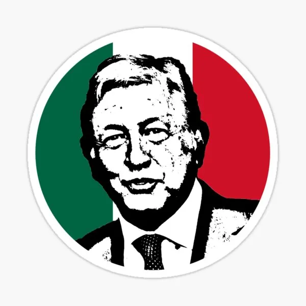

# Frases AMLO API

Una API simple para obtener frases de AMLO.

## API

### `GET /api/v1/frases-amlo`

Obtén una frase random con este formato: 

> [/api/v1/frases-amlo](/api/v1/frases-amlo)

    [
        {
            frase: "Me canso ganso"
        }
    ]

### `GET /api/v1/frases-amlo/{numero}`

Regresa un arreglo con el `{numero}` de frases e.g. `GET /api/v1/frases-amlo/5`.

> [/api/v1/frases-amlo/5](/api/v1/frases-amlo/5)

    [
        {
            frase: "Me canso ganso"
        },
        {
            frase: "Yo sigo llamando a todos a portarnos bien, a que sean abrazos, no balazos",
        },
        {
            frase: "Yo tengo otros datos",
        },
        {
            frase: "No es mi fuerte la venganza",
        },
        {
            frase: "Dinamarca es mi ejemplo a seguir… como no hay corrupción, pues no hay pobreza",
        }
    ]

## Contribuciones

Si quieres agregar una frase, agrégala en 'frases.js' y haz un pull request.

## Creditos

Inspirado por [Breaking Bad Quotes](https://github.com/shevabam/breaking-bad-quotes).
